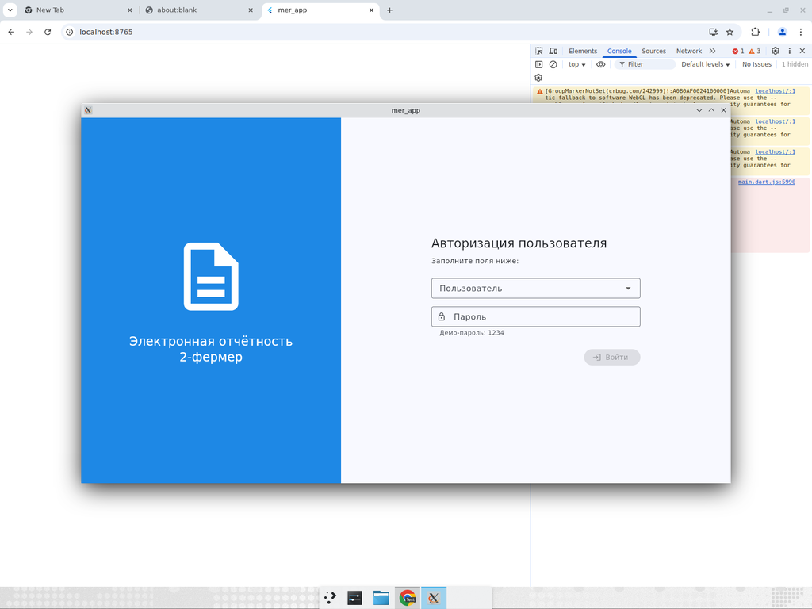
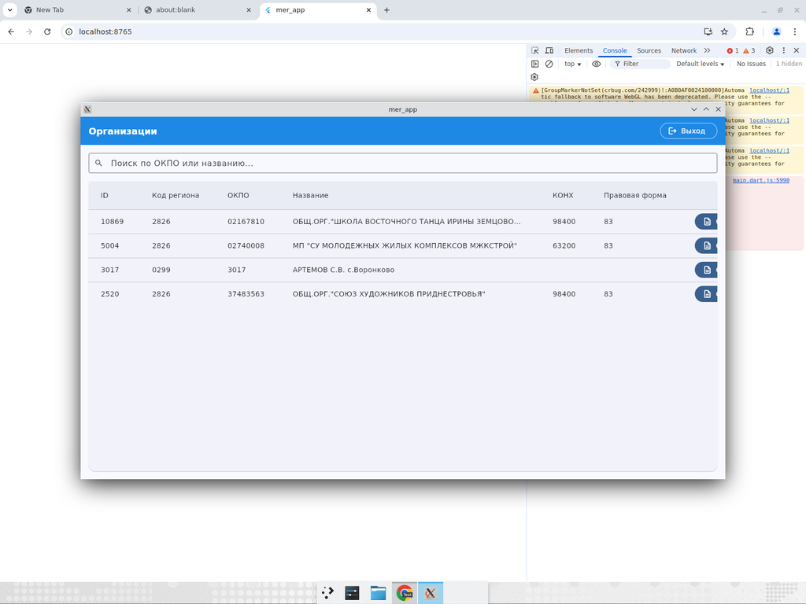
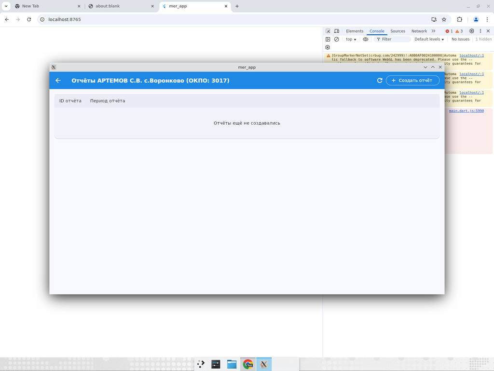
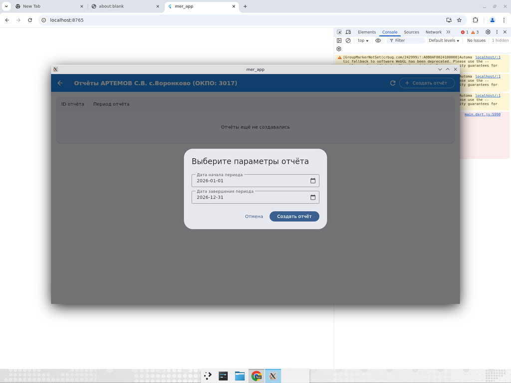
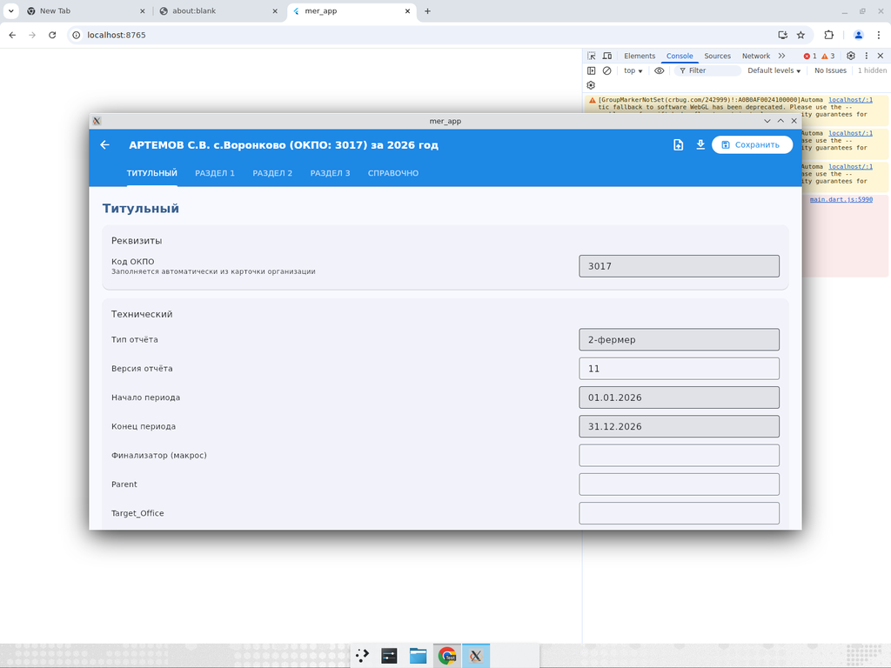
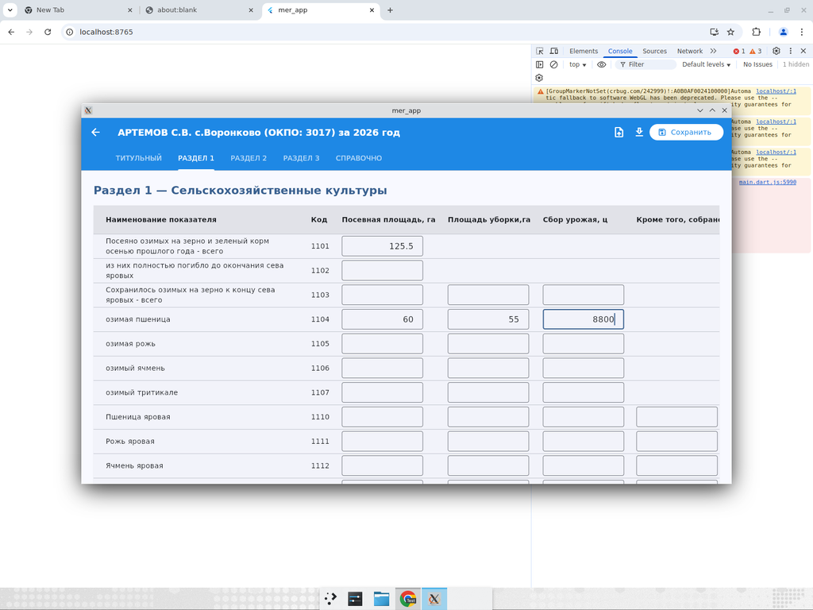

# MER — Электронная отчётность (форма 2-фермер)

Flutter-приложение для ручного ввода данных формы статистической отчётности
**2-фермер** с бумажных бланков. Структура отчёта, набор разделов и состав
показателей берётся из таблицы сопоставления (`Сопоставление 2-фермер.xlsx`).
Сохранённые отчёты выгружаются в XML, совместимый с системой
**ГИС «Электронная отчётность»** (формат `<Root><ReportData ...>` с секциями
`Отчет`, `Реквизиты`, `Технический`, `Титульный`).

## Что внутри репозитория

| Путь | Назначение |
|------|------------|
| `app/` | Flutter-приложение (desktop / web) |
| `Сопоставление 2-фермер.xlsx` | Таблица сопоставления XML-тэгов и показателей |
| `Пример отчёта XML.xml` | Эталонный XML-файл из ГИС «Электронная отчётность» |
| `Руководство пользователя v2.docx` | Руководство пользователя по аналогичному приложению (1-НКО) |
| `формы.rar` | Архив с бумажными бланками форм |
| `PLAN.md` | Архитектурный план MVP |

## Скриншоты

| Авторизация | Список организаций |
|---|---|
|  |  |

| Список отчётов | Создание отчёта | Редактор отчёта |
|---|---|---|
|  |  |  |

| Динамическая таблица показателей по разделу |
|---|
|  |

## Быстрый старт

### Требования

* **Flutter SDK ≥ 3.41** (Dart 3.11). Установка:
  * Windows — скачать ZIP с https://docs.flutter.dev/get-started/install/windows,
    распаковать в `C:\src\flutter`, добавить `C:\src\flutter\bin` в `PATH`.
  * Linux/macOS:
    ```bash
    git clone -b stable --depth 1 https://github.com/flutter/flutter.git ~/flutter
    export PATH="$HOME/flutter/bin:$PATH"
    ```
* **Windows desktop** — Visual Studio 2022 (или Build Tools) с компонентом
  *Desktop development with C++* (включает MSVC, Windows 10/11 SDK, CMake).
  Проверка: `flutter doctor`.
* **Linux desktop** — `clang`, `cmake`, `ninja-build`, `pkg-config`,
  `libgtk-3-dev`, `lld`.
* **Web** — установленный Chrome.

### Сборка и запуск

```bash
cd app
flutter pub get
```

**Windows (целевая платформа):**

```powershell
flutter config --enable-windows-desktop
flutter run -d windows          # запуск из исходников
flutter build windows --release # релизная сборка → build\windows\x64\runner\Release\mer_app.exe
```

**Linux desktop:**

```bash
flutter run -d linux
flutter build linux --release
```

**Web (превью в Chrome):**

```bash
# Однократно — генерация SQLite worker'а для браузера
# (создаёт web/sqflite_sw.js и web/sqlite3.wasm; без него страница белая).
dart run sqflite_common_ffi_web:setup
flutter run -d chrome
flutter build web --release
# после build:
cp web/sqflite_sw.js web/sqlite3.wasm build/web/
```

### Тесты и анализ

```bash
flutter analyze
flutter test
```

## Учётные данные (демо)

Демо-пользователи создаются автоматически из списка районов руководства
пользователя; пароль для всех учёток — `1234`. См. функцию `_seedUsers`
в `app/lib/data/db.dart`.

## Архитектура

* **UI** — Flutter Material 3 (desktop + web).
* **Хранение** — SQLite (`sqflite` на desktop, `sqflite_common_ffi_web` в
  браузере). Слой репозитория абстрагирован (`ReportRepository`), чтобы под
  боевую БД (Postgres / MS SQL) можно было сделать отдельную реализацию.
* **Схема формы** — таблица сопоставления хранится как ассет в
  `assets/mapping_2fermer.json` (сгенерирована из xlsx). На старте
  загружается, группируется по разделам/показателям/графам и используется для
  динамической отрисовки таблиц редактора.
* **XML I/O** — `XmlExporter` собирает документ в формате ГИС; `XmlImporter`
  парсит существующий XML и подставляет значения в редактор.

Подробнее — в [`PLAN.md`](PLAN.md).

## Скоп MVP

Включено в этот PR:

* Авторизация (выпадающий список районов + пароль).
* Список организаций с поиском по ОКПО / названию.
* Список отчётов организации.
* Создание отчёта с выбором периода.
* Редактор отчёта со вкладкой «Титульный» и вкладками по разделам формы
  2-фермер (Сельхозкультуры, Защищённый грунт, Многолетние насаждения,
  Справочно).
* Сохранение значений в локальную SQLite.
* Экспорт XML в формате ГИС «Электронная отчётность».
* Импорт XML (заполняет редактор значениями из файла).

Не входит в текущий MVP (видно из плана):

* Подключение к боевой БД организаций — описан интерфейс репозитория, можно
  добавить отдельной реализацией без изменения UI.
* Автоматический подсчёт «серых» (вычисляемых) ячеек — нужны формулы,
  специфичные для конкретной формы; вынесено в отдельную задачу.
* Формы 3-фермер и 1-НКО — UI обобщён, потребуются только новые JSON
  сопоставлений и заполнение `MetaSection` для секций «Титульный» /
  «Технический».
* Боевая авторизация (SSO/AD) — сейчас демо-пароль.
